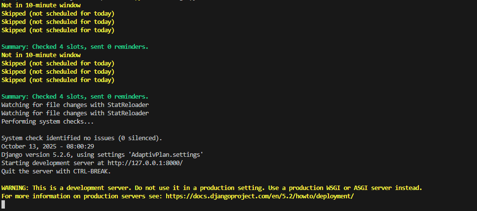

# AdaptivPlan

AdaptivPlan is a lightweight and flexible scheduling assistant designed to help busy individuals manage their weekly routines efficiently.
Built with Django and the Django REST Framework (DRF), it enables users to define availability slots, which are blocks of time allocated for specific days (e.g., Office: Mon–Fri, 08:30 AM–5:00 PM).

Users can then create tasks and assign them to these slots. Tasks can be easily reassigned or left unassigned, and AdaptivPlan automatically sends email reminders based on each task’s assigned time slot.

# Features

- User authentication (Session based authentication system)
- Availability slots (CRUD)
- Tasks (CRUD)
- View scheduled tasks
- Automatic email reminders

# Dependancies

- Django 5.2.6
- Django Rest Framework (DRF) 3.16.1

# Installation

Follow this installation guide to run the API on your local machine

- Clone the repository

On your terminal, navigate to the folder where you want to store the project. then run:
 ```
git clone https://github.com/Mafika-Mahlobo/AdaptivPlan.git
 ```

- Cd into the project derectory
```
cd AdaptivPlan/
```

- Install dependacies

Make sure python and pip are installed in your machine.
```
pip install -r requirements.txt
```

- Create .env

*create a file with the name .env in the current directory and add you credentials*
```
EMAIL_HOST_USER=your email address
EMAIL_HOST_PASSWORD=Gmail app password. **not your login passaword** (go to your gmail settings to create)
```

- Run DB migrations

```
python manage.py makemigrations
```
*and*
```
python manage.py migrate
```

# Usage

- Run the application
In the root folder (*where manage.py is located*)
```
python manage.py runserver
```

- It's running as expected when you see this:



- Open AdaptivPlan here:
```
http://127.0.0.1:8000/api/register
```
